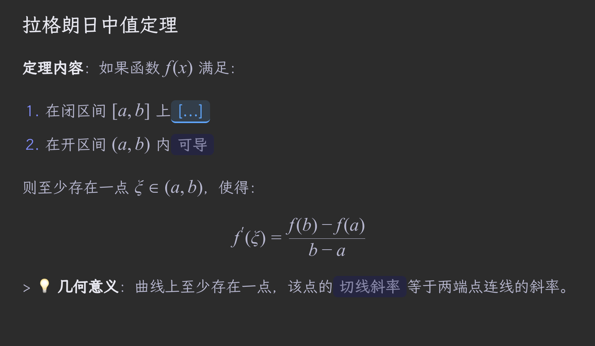
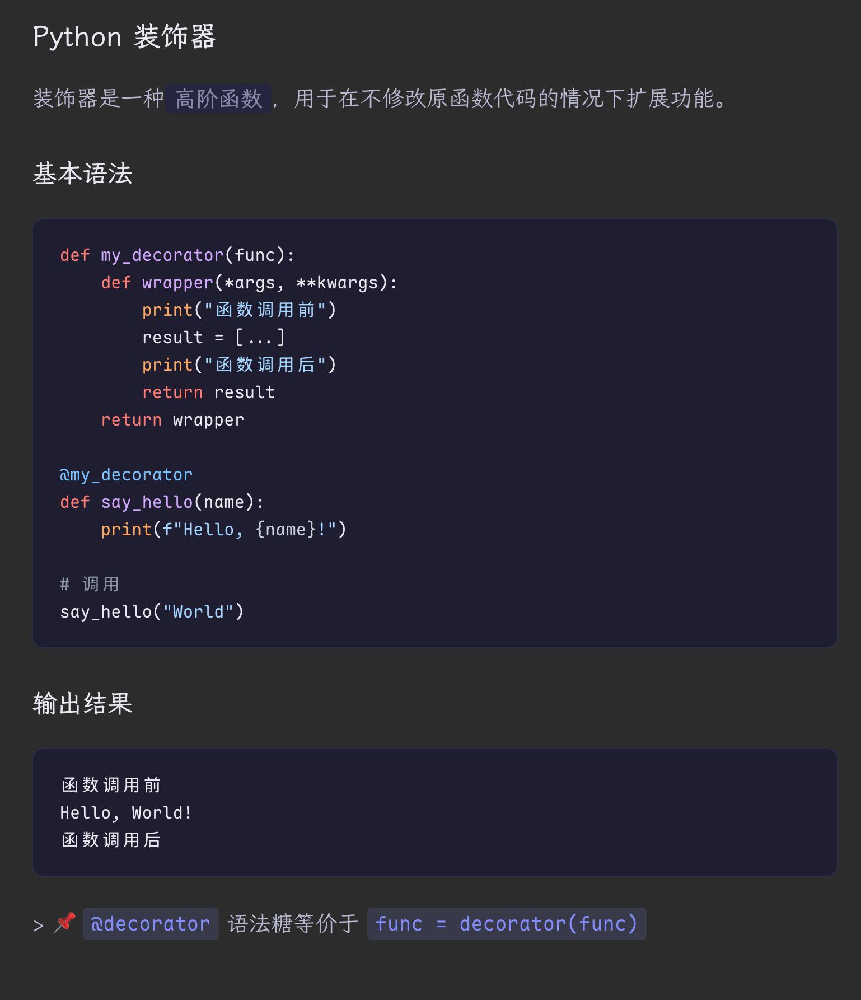

# Anki Cloze Modern Template

**English** | [中文](README_CN.md)

A beautiful, modern Anki template supporting Markdown, LaTeX, code highlighting, and 4 specialized note types. Built for serious learners who care about aesthetics and functionality.

## ✨ Features

- 🎨 **Modern Design**:
  - **Typography**: Uses **LXGW WenKai** for body text and **Maple Mono** for code.
  - **Theming**: Automatic Light/Dark mode support (follows System or Anki settings).
  - **Responsive**: Optimized for Desktop and Mobile (iOS/Android).

- 📝 **Markdown & LaTeX**:
  - **Markdown**: Support for standard syntax (tables, lists, quotes, bold/italic).
  - **Pure LaTeX**: Math formulas are rendered using KaTeX.
    - **Non-invasive**: Source LaTeX code is **never modified**.
    - **Visual Markers**: Active clozes inside formulas are marked with a **blue dashed line** (below the block or formula) via CSS, ensuring readability without altering the math itself.

- 💻 **Code Highlighting**:
  - Automatically highlights code blocks (Python, JS, C++, etc.) using Highlight.js.
  - Distinct active/inactive styles.

- ⌨️ **Typing Support**:
  - Dedicated templates for typing answers.
  - **Visual Diff** (Green/Red background) to verify your spelling accuracy.

## 🗂 Note Types

Running the sync script will automatically create these **5** note types in Anki:

### 1. Cloze-Modern (Standard Cloze)
- **Type**: Cloze
- **Description**: The classic fill-in-the-blank experience supercharged with Markdown/LaTeX.
- **Fields**:
  - `Text`: The content with clozes (e.g., `The capital of France is {{c1::Paris}}.`).
  - `Extra`: Additional info shown on the back.

### 2. Cloze-Modern-Typing (Typing Cloze)
- **Type**: Cloze
- **Description**: Input box appears for the active cloze. You must type the answer. Back side shows a diff comparison.
- **Use Case**: Language learning (spelling words), programming syntax.

### 3. Basic-Modern (Q&A)
- **Type**: Basic (Non-Cloze)
- **Description**: Standard Front/Back card.
- **Fields**:
  - `Front`: Visible question.
  - `Back`: Answer shown after flipping.
- **Use Case**: Concept definitions, open-ended questions.

### 4. Basic-Modern-Reversed (Two-Way Q&A)
- **Type**: Basic
- **Description**: One note generates **two cards**: Front→Back and Back→Front.
- **Fields**: Same as Basic-Modern.
- **Use Case**: Vocabulary (English ↔ Chinese), bidirectional memorization.

### 5. Basic-Modern-Typing (Typing Q&A)
- **Type**: Basic
- **Description**: Question on front with an input box. Type the full answer to check against the Back field.
- **Use Case**: Memorizing exact definitions or code snippets.

## 🚀 Installation

### Prerequisites
1. **Anki Desktop** (latest version recommended).
2. **AnkiConnect Plugin**:
   - Open Anki -> Tools -> Add-ons -> Get Add-ons.
   - Code: `2055492159`
   - **Restart Anki** after installation.

### Setup
1. Clone or download this repository.
2. **Download Resources** (Run the provided Shell scripts):
   ```bash
   # 1. Download Fonts (LXGW WenKai, Maple Mono)
   bash sync_font.sh
   
   # 2. Download JS/CSS Libraries (Marked, KaTeX, Highlight.js)
   bash sync_libs.sh
   ```
   *(Windows users please use Git Bash or WSL)*

3. **Sync to Anki**:
   ```bash
   python3 anki_connect.py
   ```
   This script will:
   - ✅ Sync downloaded fonts and libraries to Anki media folder.
   - ✅ Create/Update the 4 Note Types in Anki.
   - ✅ Create Example Cards in the "Default" deck.

## ✍️ Usage Examples

### Markdown
Simply write Markdown in the fields:

```markdown
# Heading
- List item 1
- List item 2

**Bold text** and *Italic text*.
```

### LaTeX Math
Use `$$...$$` for block math and `$...$` for inline math.

```latex
The quadratic formula is:
$${{c1::x = \frac{-b \pm \sqrt{b^2 - 4ac}}{2a}}}$$
```
*(Note: The active part will be visually marked with a blue dashed line on the back)*

### Code Block
```python
def hello():
    print("Hello Anki")
```


## 📸 Screenshots

### 1. LaTeX Rendering
*(Pure LaTeX, visually marked active clozes with blue dashed lines)*



### 2. Code Highlighting
*(Supports multiple languages, auto Light/Dark mode)*



### 3. Typing & Diff
*(Supported by Basic-Typing and Cloze-Typing templates)*


---
**Enjoy your learning!**
